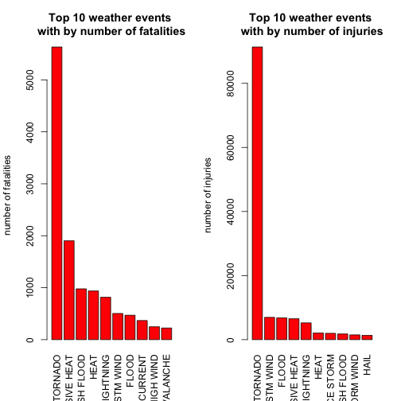
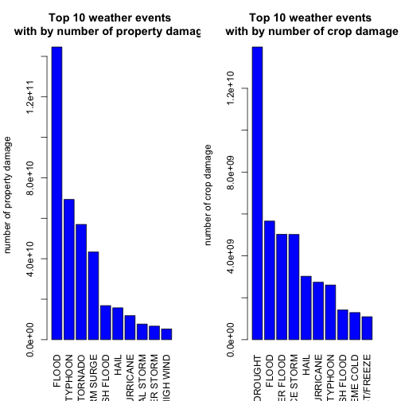

Which are the most harmful Weather Events for public health and economy.
========================================================
 


# Synopsis
The goal of current data analysis is to explore the U.S. National Oceanic and Atmospheric Administration's (NOAA) storm database and answer the following questions:

1 Across the United States, which types of events (as indicated in the EVTYPE variable) are most harmful with respect to population health?

2 Across the United States, which types of events have the greatest economic consequences?

First , the data was processed and cleaned,removed unnecessary rows and calculated crop and property damage.

Analysis showed that Tornados,Flood, Excessive Heat have the highest impact on populations health and economy.
## Data

The data for this assignment come in the form of a comma-separated-value file compressed via the bzip2 algorithm to reduce its size: [Storm data](https://d396qusza40orc.cloudfront.net/repdata/data/StormData.csv.bz2).

There is also some documentation of the database available. Here you will find how some of the variables are constructed/defined.
[National Weather Service Storm Data Documentation](https://d396qusza40orc.cloudfront.net/repdata/peer2_doc/pd01016005curr.pdf)
The events in the database start in the year 1950 and end in November 2011. In the earlier years of the database there are generally fewer events recorded

## Loading and Processing the Raw Data


```r
dataset<-read.csv("repdata_data_StormData.csv",stringsAsFactors=FALSE)
#evtab<-data.frame(dataset$EVTYPE,dataset$FATALITIES,dataset$INJURIES,dataset$PROPDMG,dataset$PROPDMGEXP,dataset$CROPDMG,dataset$CROPDMGEXP)
```

**Cleaning data set**

The aim of current section is to clean dataset.
First of all, the record "Summary" event is removed:

```r
dataset <- dataset[!grepl("Summary", dataset$EVTYPE),  ]
```
Next step is to culculate property and crop damage.The data is presenting as the data in  PROPDMG and CROPDMG and multitlier int he columns PROPDMGEXP and CROPDMGEXP.The data in these columns are presented like:
- H for hundreds ("2")

- K for thousands ("3")

- M for millions  ("6")

- B for billions  ("9")
 
All the marks and values, which are outside of these values, are removed and converted to the numerical values.

```r
exp<- c("^$|[-?+]", "[hH]", "[kK]", "[mM]", "[bB]")
now <- c("0", "2", "3", "6", "9")
for (i in 1:length(exp)) {
     dataset$PROPDMGEXP <- sub(exp[i], now[i], dataset$PROPDMGEXP) 
     dataset$CROPDMGEXP <- sub(exp[i], now[i], dataset$CROPDMGEXP)
}
dataset$PROPDMGEXP <- as.numeric(dataset$PROPDMGEXP)
dataset$CROPDMGEXP <- as.numeric(dataset$CROPDMGEXP)

var<-c("EVTYPE","FATALITIES","INJURIES","PROPDMG","PROPDMGEXP","CROPDMG","CROPDMGEXP")
dt<-dataset[var]
#culculate property and crop damage
dt["PROP"]<-0
dt["CROP"]<-0
dt$PROP <-dt$PROPDMG*(10^dt$PROPDMGEXP)
dt$CROP <-dt$CROPDMG*(10^dt$CROPDMGEXP)

var<-c("EVTYPE","FATALITIES","INJURIES","PROP","CROP")
dt<-dt[var]
```
Arregation the data over EVTYPE

```r
result <-aggregate(.~EVTYPE,data=dt,sum)

dim(result)
```

```
## [1] 921   5
```

## Results

At current section we will answer the question, **which types of weather events are most harmful with respect to population health**
Health damage is calculated by summing number of fatalities and injuries per category

```r
fatal<-result[order(result$FATALITIES,decreasing=TRUE),][1:10,]
 head(fatal,10)
```

```
##             EVTYPE FATALITIES INJURIES      PROP      CROP
## 770        TORNADO       5633    91346 5.695e+10 4.150e+08
## 129 EXCESSIVE HEAT       1903     6525 7.754e+06 4.924e+08
## 152    FLASH FLOOD        978     1777 1.682e+10 1.421e+09
## 274           HEAT        937     2100 1.797e+06 4.015e+08
## 463      LIGHTNING        816     5230 9.304e+08 1.209e+07
## 792      TSTM WIND        504     6957 4.485e+09 5.540e+08
## 169          FLOOD        470     6789 1.447e+11 5.662e+09
## 584    RIP CURRENT        368      232 1.000e+03 0.000e+00
## 358      HIGH WIND        248     1137 5.270e+09 6.386e+08
## 19       AVALANCHE        224      170 3.722e+06 0.000e+00
```

```r
inj <-result[order(result$INJURIES,decreasing=TRUE),][1:10,]
head(inj,10)
```

```
##                EVTYPE FATALITIES INJURIES      PROP      CROP
## 770           TORNADO       5633    91346 5.695e+10 4.150e+08
## 792         TSTM WIND        504     6957 4.485e+09 5.540e+08
## 169             FLOOD        470     6789 1.447e+11 5.662e+09
## 129    EXCESSIVE HEAT       1903     6525 7.754e+06 4.924e+08
## 463         LIGHTNING        816     5230 9.304e+08 1.209e+07
## 274              HEAT        937     2100 1.797e+06 4.015e+08
## 426         ICE STORM         89     1975 3.945e+09 5.022e+09
## 152       FLASH FLOOD        978     1777 1.682e+10 1.421e+09
## 696 THUNDERSTORM WIND        133     1488 3.483e+09 4.148e+08
## 243              HAIL         15     1361 1.574e+10 3.026e+09
```


```r
par(mfrow = c(1, 2))
barplot(fatal$FATALITIES,las=3, names.arg = fatal$EVTYPE, 
        main="Top 10 weather events \nwith by number of fatalities", ylab="number of fatalities",col="red")  
barplot(inj$INJURIES,las=3, names.arg = inj$EVTYPE, 
        main="Top 10 weather events \nwith by number of injuries", ylab="number of injuries",col="red")    
```

 

** Which types of events have the greatest economic consequences**

To answer this question, we find weather events which have the highest impact on property damage and crop damage.

```r
prop<-result[order(result$PROP,decreasing=TRUE),][1:10,]
 head(fatal,10)
```

```
##             EVTYPE FATALITIES INJURIES      PROP      CROP
## 770        TORNADO       5633    91346 5.695e+10 4.150e+08
## 129 EXCESSIVE HEAT       1903     6525 7.754e+06 4.924e+08
## 152    FLASH FLOOD        978     1777 1.682e+10 1.421e+09
## 274           HEAT        937     2100 1.797e+06 4.015e+08
## 463      LIGHTNING        816     5230 9.304e+08 1.209e+07
## 792      TSTM WIND        504     6957 4.485e+09 5.540e+08
## 169          FLOOD        470     6789 1.447e+11 5.662e+09
## 584    RIP CURRENT        368      232 1.000e+03 0.000e+00
## 358      HIGH WIND        248     1137 5.270e+09 6.386e+08
## 19       AVALANCHE        224      170 3.722e+06 0.000e+00
```

```r
crop <-result[order(result$CROP,decreasing=TRUE),][1:10,]
head(prop,10)
```

```
##                EVTYPE FATALITIES INJURIES      PROP      CROP
## 169             FLOOD        470     6789 1.447e+11 5.662e+09
## 410 HURRICANE/TYPHOON         64     1275 6.931e+10 2.608e+09
## 770           TORNADO       5633    91346 5.695e+10 4.150e+08
## 669       STORM SURGE         13       38 4.332e+10 5.000e+03
## 152       FLASH FLOOD        978     1777 1.682e+10 1.421e+09
## 243              HAIL         15     1361 1.574e+10 3.026e+09
## 401         HURRICANE         61       46 1.187e+10 2.742e+09
## 784    TROPICAL STORM         58      340 7.704e+09 6.783e+08
## 908      WINTER STORM        206     1321 6.688e+09 2.694e+07
## 358         HIGH WIND        248     1137 5.270e+09 6.386e+08
```

```r
head(crop,10)
```

```
##                EVTYPE FATALITIES INJURIES      PROP      CROP
## 94            DROUGHT          0        4 1.046e+09 1.397e+10
## 169             FLOOD        470     6789 1.447e+11 5.662e+09
## 589       RIVER FLOOD          2        2 5.119e+09 5.029e+09
## 426         ICE STORM         89     1975 3.945e+09 5.022e+09
## 243              HAIL         15     1361 1.574e+10 3.026e+09
## 401         HURRICANE         61       46 1.187e+10 2.742e+09
## 410 HURRICANE/TYPHOON         64     1275 6.931e+10 2.608e+09
## 152       FLASH FLOOD        978     1777 1.682e+10 1.421e+09
## 139      EXTREME COLD        160      231 6.774e+07 1.293e+09
## 211      FROST/FREEZE          0        0 9.480e+06 1.094e+09
```

```r
par(mfrow = c(1, 2))
barplot(prop$PROP,las=3, names.arg = prop$EVTYPE, 
        main="Top 10 weather events \nwith by number of property damage", ylab="number of property damage",col="blue")  
barplot(crop$CROP,las=3, names.arg = crop$EVTYPE, 
        main="Top 10 weather events \nwith by number of crop damage", ylab="number of crop damage",col="blue")    
```

 
    
